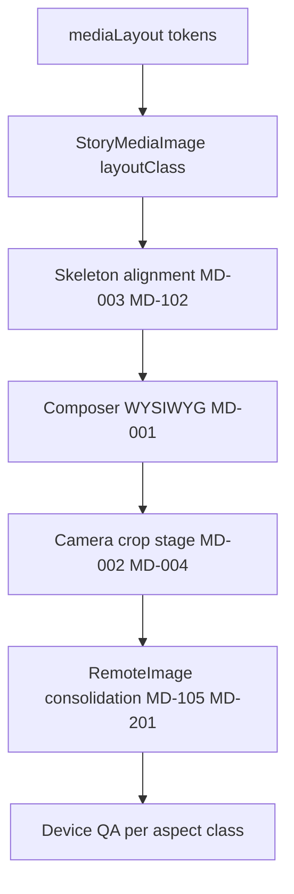

# Native media drift register

**Date:** 2026-05-18  
**Purpose:** Exact native media inconsistencies, prioritized for the **unified implementation pass**.  
**Do not fix ad hoc** — close items via [INTENCITY_MEDIA_DOCTRINE.md](./INTENCITY_MEDIA_DOCTRINE.md) tokens + single PR pass.  
**Audit source:** [MEDIA_ARCHITECTURE_AUDIT.md](./MEDIA_ARCHITECTURE_AUDIT.md)

**Severity**

| Level | Meaning |
|-------|---------|
| **P0** | Breaks trust, WYSIWYG, or causes visible broken media |
| **P1** | Clear parity/cohesion gap; user notices inconsistency |
| **P2** | Technical debt; maintainability / performance |
| **P3** | Future optimization; acceptable for VP-2 if documented |

---

## P0 — Block unified polish until resolved

| ID | Status | Drift | Resolution (MEDIA-1) |
|----|--------|-------|----------------------|
| **MD-001** | **Fixed** | Composer preview ≠ published crop | `ComposerMediaPreview` — hub height-cap for shares, 9:16 for moments (`cover`) |
| **MD-002** | **Partial** | Camera upload has no aspect enforcement | `cropImageToAspect` center-crop after shutter (not full interactive `react-easy-crop` UI) |
| **MD-003** | **Fixed** | Hub share skeleton ≠ loaded card geometry | Skeleton uses `hubShareMediaHeight()` token |
| **MD-004** | **Fixed** | Library vs camera same-mode aspect mismatch | Camera path runs same aspect crop as library target |

---

## P1 — Cohesion / parity (VP-2 signoff relevant)

| ID | Status | Drift | Resolution (MEDIA-1) |
|----|--------|-------|----------------------|
| **MD-101** | **Fixed** | Share 4:5 asset cropped twice | `ComposerMediaPreview` simulates hub height-cap box |
| **MD-102** | **Fixed** | Moment detail skeleton ≠ media frame | Skeleton uses `shareDetailMediaFrameStyle()` |
| **MD-103** | **Fixed** | Profile grid duplicated | `ProfileMediaGridCell` + `squareGridCellStyle` |
| **MD-104** | **Fixed** | Venue hero height split | `mediaLayout.venueHero.height` = 168 everywhere |
| **MD-105** | **Fixed** | Venue activity uses RN Image | `RemoteImage` + `VENUE_HERO` |
| **MD-106** | **Partial** | PWA interactive crop stage | Center-crop after camera; no pinch/zoom stage yet |
| **MD-107** | **Deferred** | Look filters not applied | Unchanged — MEDIA-1.1 or hide filter UI |
| **MD-108** | **Accepted** | Grid 1:1 → detail 4:5 visual jump | Product-expected; documented |
| **MD-109** | **Mitigated** | Tab avatar flash | Always `TabBarProfileAvatar` + holdover; confirm on device QA |

---

## P2 — Technical debt

| ID | Status | Drift | Resolution (MEDIA-1) |
|----|--------|-------|----------------------|
| **MD-201** | **Fixed** | Dual remote image stacks | `IntencityRemoteImage` — story/venue unified; static brand assets still RN `Image` |
| **MD-202** | **Open** | `media_url` / `image_url` asymmetry | Unchanged |
| **MD-203** | **Fixed** | Normalize failure uploads original bytes | Upload fails if normalize fails |
| **MD-204** | **Fixed** | No max dimension cap | `maxLongEdge: 2048` in normalize + crop |
| **MD-205** | **Fixed** | Per-surface layout magic numbers | `theme/mediaLayout.ts` |
| **MD-206** | **Deferred** | Single asset for all surfaces | Future CDN variants |
| **MD-207** | **Fixed** | Picker vs normalize quality | Unified `mediaLayout.ingest` 0.9 |

---

## P3 — Deferred / accepted

| ID | Drift | Notes | Phase |
|----|-------|-------|-------|
| **MD-301** | No blurhash / LQIP | Solid placeholder only | Future media infra |
| **MD-302** | No moment thumbnail in rail | PWA parity — avatars only | By design |
| **MD-303** | Avatar upload stub on profile edit | PWA has upload | MEDIA-1 / profile slice |
| **MD-304** | No chat image attachments | N/A on native | When chat media ships |
| **MD-305** | No CDN derived sizes | expo-image disk cache only | Backend phase |
| **MD-306** | Hub share feed not pure 4:5 frame | Matches PWA `max-h` semantics | **Do not “fix” to IG 4:5** |
| **MD-307** | `/shares/new` route redirects to composer | PWA has dedicated page | Route parity optional |

---

## Cross-reference: behavior vs rendering

Rendering drifts (this register) are **orthogonal** to behavioral drifts in [MEDIA_BEHAVIOR_MATRIX.md](./MEDIA_BEHAVIOR_MATRIX.md) (refresh, expiry, optimistic UI).  

Implementation pass **may** touch both only where shared components overlap (e.g. `StoryMediaImage`).

---

## Recommended fix order (unified pass)

1. **Tokens** — `mediaLayout.ts` + hub skeleton (MD-003)  
2. **Renderer** — layout class on `StoryMediaImage` (MD-201)  
3. **Composer** — preview boxes + crop stage (MD-001, MD-002, MD-004)  
4. **Venue** — `RemoteImage` + hero height (MD-104, MD-105)  
5. **Profile grid** — dedupe (MD-103)  
6. **Normalize hardening** (MD-203, MD-204)  
7. **Filters / avatar** — MEDIA-1 unless blocking VP-2 (MD-107, MD-303)  

---

## Sign-off checklist

Before VP-2 media cohesion sign-off:

- [x] All **P0** items resolved or explicitly accepted (MD-002 partial = center crop)  
- [x] **P1** MD-101–MD-106 addressed or documented (MD-106/107 partial/deferred)  
- [x] [INTENCITY_MEDIA_DOCTRINE.md](./INTENCITY_MEDIA_DOCTRINE.md) implemented in `theme/mediaLayout.ts` + media components  
- [ ] **Device QA** — library share, camera moment, hub scroll, viewer, profile grid, detail  
- [x] No new per-component width/height constants without token (audit pass)  

---

## Changelog

| Date | Change |
|------|--------|
| 2026-05-18 | Initial register from native media architecture audit |
| 2026-05-18 | **MEDIA-1** implementation — P0/P1/P2 items updated per code pass |
