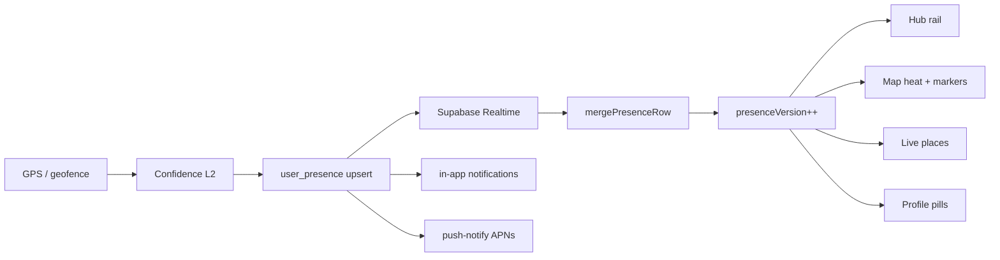

# Native Cutover — Part 2

**Status:** Blocked on **Apple Developer Program** ($99/yr) for iOS push + store · **Unified Instant plan** ready to execute on enrollment day  
**Last updated:** 2026-06-05  
**Authority:** Deferred work from [NATIVE_CUTOVER.md](./NATIVE_CUTOVER.md) — Apple-gated items **and** the coordinated “everything updates at once” presence program.

> **Product goal:** When presence changes, **online rail, heat, map markers, live places, and notifications** should refresh in **one ripple** — as fast and reliably as physics allows, without flicker or trust lies. Part 2 is the shortest realistic path to that.

---

## Why Part 2 exists

Part 1 ships native product logic that does **not** require Apple’s paid portal. Part 2 is everything that **does** — plus the **architecture pass** that makes instant feel unified instead of staggered.

During Part 1 QA we hit:

- Xcode: provisioning profile does not support Push Notifications
- developer.apple.com: **Access Unavailable** (not enrolled / wrong Apple ID)

There is **no legitimate bypass** for remote push on a custom bundle ID (`com.intencity.app`) on a physical iPhone. Expo, Supabase Edge Functions, and EAS all still need Apple’s Push capability on the App ID.

**What still works without Part 2:** in-app notifications, Realtime toasts, chat while foregrounded, PWA web push (Safari), Android native push (FCM dev builds), and all presence/copy/timing work in Part 1 Phases 2–3.

---

## Part 2 scope (two tracks, one release)

| Track | What | Why Part 2 |
|-------|------|------------|
| **A — Apple infra** | APNs, TestFlight, entitlements | Paid portal required |
| **B — Unified Instant** | One ripple → all surfaces | Bundled so “instant” ships **once**, not in pieces |
| **C — Background truth** | Always location, geofences | Apple background modes + review |
| **D — OS surface** | Lock-screen push, Live Activities | APNs + extensions |

**Do not** ship Track B in fragments across months — that’s how Hub feels live but Map lags. Part 2 exit = **all tracks QA’d together**.

---

## D — Unified Instant Presence Program

### The problem today (honest)

Rules are unified (`user_presence` + `@intencity/shared`). **Delivery is not.**

```text
Today (staggered):
  Write (3–5s interval) ──→ Supabase
       ├─ Realtime ──→ merge one row ──→ Map may update
       ├─ Poll (3s map / 20s hub) ──→ full fetch ──→ Hub may update later
       └─ UI clock (10s) ──→ recompute labels on old data

  Local FSM preview ──→ only YOUR chip updates early
  Notifications ──→ created on write path (good) but OS banner needs APNs (Part 2)
```

Surfaces **can** show different truth for 0–20s. That’s not a window bug — it’s **multiple clocks and fetch paths**.

### Target: “One ripple”

```text
Target (Part 2):
  GPS fix (or geofence wake)
       ↓
  Confidence gate (Phase 4 L2 — no bad writes)
       ↓
  Write user_presence (on movement OR heartbeat cap)
       ↓
  Supabase postgres_changes ──→ ONE client merge
       ↓
  presenceRipple(version++)  ──→ same React commit:
       · Hub online rail
       · Map markers + heat GeoJSON + checkpoints
       · Live places rank
       · Venue sheet counts
       · Friend profile pills
       · In-app notification rows (already on write path)
       ↓
  push-notify (Part 2 A) ──→ OS banner when backgrounded
```

**Principle:** One row change → one in-memory merge → one `presenceVersion` bump → all selectors use `Date.now()` at render time. Polls become **health-check only**, not primary delivery.



### Realistic SLAs (foreground, good network)

These are **achievable** — not marketing “0ms.”

| Signal | p95 target | Hard floor (trust) | Notes |
|--------|------------|-------------------|-------|
| Friend dot / coords on Map | **≤ 2s** | — | GPS-triggered write + realtime |
| Hub “online” rail add/remove | **≤ 3s** | 2m badge window | Realtime-primary; poll is backup |
| Heat / glow count change | **≤ 3s** data | 8m heat window | Same ripple; optional 300ms visual debounce on *color* only |
| “At {venue}” social copy | **≤ 90s** attach | `INNER_CONFIRM_MS` | **Intentionally not instant** — trust |
| In-app presence notification | **≤ 2s** | — | Already on native write path |
| OS lock-screen notification | **≤ 5s** | — | Needs APNs (Track A) |
| Background friend location | **≤ 1 live window** | Always opt-in | Track C |

**Not a goal:** sub-second heat for everyone, 24/7 dot tracking, or removing dwell confirm. Faster **wrong** is worse than 2s **right**.

---

### Pre–Part 2 prep (Part 1 — do before enrollment day)

Small fixes that **de-risk** Part 2 but don’t require Apple. Finish these while continuing current QA; **do not** call Part 2 started until enrollment.

| # | Task | Effort | Why |
|---|------|--------|-----|
| P0 | Fix `presenceClock` misuse — tick is a **re-render trigger only**; all freshness math uses `Date.now()` | ~2h | Map/profile pills can compute wrong ages after first 10s tick |
| P0 | GPS **movement-triggered** write (min 2s spacing) in addition to interval heartbeat | ~4h | Biggest “feels instant” win without Apple |
| P1 | `presenceNowMs()` helper — single import, banned `presenceClock` as timestamp | ~2h | Prevents regression |
| P1 | Realtime health flag — skip foreground poll when channel `SUBSCRIBED` >30s | ~4h | Hub catches up with Map |
| P1 | Phase 3 device QA sign-off | — | Baseline before rippling |

**Gate:** Part 2 Track B starts **after P0 + P1** land on `main`.

---

### Part 2 execution plan (shortest reliable path)

**Total calendar time (focused): ~2–3 weeks** after Apple enrollment, assuming one engineer + device QA. Parallel Android push QA throughout.

#### Sprint 0 — Enrollment day (Track A) · ~1 day

| Step | Action |
|------|--------|
| 0.1 | Enroll Apple Developer Program (or join org team) |
| 0.2 | Enable Push on `com.intencity.app` |
| 0.3 | Restore `aps-environment` + Push capability in Xcode |
| 0.4 | Upload APNs `.p8` to Expo (`eas credentials`) |
| 0.5 | Rebuild dev client → `push_subscriptions` row on iPhone |
| 0.6 | E2E: background DM → lock-screen banner → tap opens chat |

See [Part 2 exit checklist (Apple)](#part-2-exit-checklist-apple) below.

#### Sprint 1 — One ripple client · ~3–4 days

| # | Deliverable | Files / notes |
|---|-------------|---------------|
| 1.1 | `PresenceRippleProvider` or extend `PresenceProvider` with monotonic `presenceVersion` bumped on every merge (realtime + self-write echo) | `PresenceProvider.tsx`, `useUserPresenceState.ts` |
| 1.2 | All surfaces depend on `presenceVersion` + `presence[]` — remove redundant per-screen polls (`LivePlacesScreen` extra poll → optional) | `LivePlacesScreen.tsx`, `hub.tsx`, `map.tsx` |
| 1.3 | `selectPresenceDerived(state, nowMs)` — optional shared memo for hub rail / heat / markers from one input snapshot | new `presenceDerived.ts` or `@intencity/shared` orchestrator |
| 1.4 | Poll policy: foreground **60s health-check** when realtime healthy; fall back to Phase 3 intervals only on disconnect | `backgroundReadPolicy.ts` |
| 1.5 | Self-write optimistic merge — your row updates locally before round-trip (friends already get realtime) | `writeDevicePresence.ts`, merge on success |

**Exit:** Friend moves → Hub rail + Map heat + markers update in **same frame** (screen record proof).

#### Sprint 2 — Confidence before speed (Track B + Phase 4 foreground) · ~3–4 days

| # | Deliverable | Why first |
|---|-------------|-----------|
| 2.1 | Wire `acceptDeviceFix` / accuracy + teleport gates **before** every write | Faster writes without this = faster **wrong** heat |
| 2.2 | Jitter hold — inner↔outer bounce → hold zone 10–15s | Stops count flicker when “instant” |
| 2.3 | Server stale-row cleanup — clear `venue_id` when coords outside outer + aged out | Zombie heat blocks “accurate instant” |
| 2.4 | Motion-aware duty cycle (foreground) — low power when stationary in inner zone | Battery headroom for burst-on-move |

**Exit:** Bad GPS fix does not spike heat; venue detach honest within 8m window.

#### Sprint 3 — Background + geofence (Track C) · ~4–5 days

Requires Sprint 0 + App Store privacy copy for **Always** location.

| # | Deliverable |
|---|-------------|
| 3.1 | Settings → “Keep presence updated in background” (opt-in, ghost clears pipeline) |
| 3.2 | iOS `UIBackgroundModes: location` + Android foreground service pattern as needed |
| 3.3 | Register geofences at venue **outer** radii (cap ~20 nearest) — wake → burst write |
| 3.4 | Background read policy: 60s poll + geofence wake (no 3s background writes) |
| 3.5 | `friend_nearby` + `friend_joined_venue` OS push via `push-notify` |

**Exit:** Friend backgrounds app at venue → you still see heat ≤8m; leaving venue → decay within one live window.

#### Sprint 4 — Social velocity bundle (Track D + Phase 5 overlap) · ~3 days

Ship with Sprint 1–3 QA — not separately.

| # | Deliverable |
|---|-------------|
| 4.1 | Chat realtime hardening (already close — verify poll fallback only on disconnect) |
| 4.2 | Hub story ring realtime <1s (existing hook — perf pass) |
| 4.3 | Notification bundle debounce on edge (`friends_active_bundle`, 30s) |
| 4.4 | TestFlight build for 2+ friend soak test |

---

### Part 2 Unified Instant — exit checklist

All must pass **in one QA session** (two phones, screen recording):

- [ ] Friend opens app → Hub rail + Map marker + heat count update **together** within **3s**
- [ ] Friend walks into venue outer ring → nearby count rises **together** on Map sheet + live places
- [ ] Friend inner dwell 90s → “At {venue}” copy **together** on Hub + profile (not before 90s)
- [ ] Friend kills app → online rail drops within **2m**; heat drops within **8m** — all surfaces agree
- [ ] You background app → friend still sees accurate heat (Track C) OR honest decay (if Always off)
- [ ] Background DM → iOS lock-screen banner **≤5s** (Track A)
- [ ] Ghost mode → anonymous heat only; rail hidden — instant on toggle
- [ ] Airplane mode 30s → reconnect → **one resume ripple** refreshes all tabs (no 20s hub lag)

---

### Explicit non-goals (avoid problems)

| Temptation | Why skip |
|------------|----------|
| 1s global poll | Burns battery; masks broken realtime |
| Sub-second writes for all users | Supabase cost + GPS noise |
| Same window for online + heat | Dead venues glow or live friends vanish |
| Remove `INNER_CONFIRM_MS` | False check-ins — kills trust |
| “Instant heat” without confidence L2 | Parking-lot spikes |
| Ship Track A push without Track B ripple | OS banner says “friend joined” while Hub still stale |

---

## Blocked items (Apple gate — complete list)

### A — iOS device push (NOTIF-4 iOS)

| Item | Why blocked |
|------|-------------|
| Enable **Push Notifications** on App ID `com.intencity.app` | Requires Certificates, Identifiers & Profiles (paid program) |
| `aps-environment` entitlement in dev client | Provisioning profile must include push — fails on Personal Team |
| `getExpoPushTokenAsync` → `push_subscriptions` row on iPhone | Token registration needs valid APNs + Expo project credentials |
| **push-notify** iOS E2E QA (background DM → lock-screen banner) | No token → `sent: 0` |
| Upload **APNs Auth Key** (.p8) to Expo (`eas credentials`) | Key created in Apple portal (paid program) |
| Optional `EXPO_ACCESS_TOKEN` + production push hardening | Same infra dependency |

**Code status:** Shipped in Part 1 (`push-notify` edge function, `requestPushNotify.ts`, `nativePushSubscription.ts`). **iOS entitlements reverted** so local `expo run:ios` builds without push capability until enrollment.

**Interim validation (no Apple fee):**

- **Android** dev build → FCM push E2E
- **PWA** web push on phone (Vercel `/api/push/notify` or edge function for `expo:` + web endpoints)
- **In-app** notification rows + toasts (already working)

---

### B — App Store & TestFlight

| Item | Why blocked |
|------|-------------|
| TestFlight internal/external testing | Paid program |
| App Store submission | Paid program |
| Production push certificates / keys tied to distribution profile | Paid program |

Part 1 local dev client sideloading on your own device can continue on Personal Team **without** push. Store distribution waits for Part 2.

---

### C — Advanced iOS capabilities (Phases 4 & 7)

| Item | Phase | Why blocked |
|------|-------|-------------|
| **Always** background location (opt-in) | 4.3 | Background modes + App Store location justification |
| **Geofence** venue boundary wake | 4.4 | Region monitoring entitlement + review |
| **Live Activities / widgets** (“friend arrived at …”) | 7 | Widget extension + push + store review |

**Not blocked in Part 1:** foreground GPS, map presence reads, native presence **writes** (Phase 2), timing windows (Phase 3), chat queue (Phase 1.2), Sprint 1–2 foreground ripple (after pre-prep).

---

## Part 2 exit checklist (Apple)

When enrolled (or added to org team `3FJL6YY236` with portal access):

1. [ ] developer.apple.com → Identifiers → `com.intencity.app` → **Push Notifications** ON
2. [ ] Xcode → Signing & Capabilities → **Push Notifications** (or `eas credentials` → APNs key)
3. [ ] Restore `aps-environment` in `Intencity.entitlements` + Push capability in Xcode project
4. [ ] Rebuild dev client (`npx expo run:ios --device` or `eas build --profile development`)
5. [ ] Phone → Settings → Notification settings → Save → row in `push_subscriptions` (`expo:…`)
6. [ ] Background app → DM from friend → OS banner; tap opens chat route
7. [ ] Edge function logs show `sent ≥ 1` for native send path
8. [ ] [Unified Instant exit checklist](#part-2-unified-instant--exit-checklist) — all items pass
9. [ ] (Optional) TestFlight build for wider QA

---

## Relationship to Part 1 phases

| Part 1 phase | Part 2 dependency |
|--------------|-------------------|
| **1.1 Push off web** | Code ✅ · iOS QA → Part 2 Track A |
| **1.2 Chat queue** | None |
| **1.3 Typing** | None |
| **2 Presence writes** | None · ripple merge → Track B Sprint 1 |
| **3 Timing / windows** | None · OS delivery of presence push → Track A |
| **4 Location accuracy** | Foreground L2 → Sprint 2 · Always/geofence → Track C |
| **5 Social velocity** | Bundled in Sprint 4 · iOS banners → Track A |
| **6 Web cutover** | Can proceed without Part 2 |
| **7 Superpowers** | Live Activities → Track D |

---

## Key files (Unified Instant)

| Area | Files |
|------|--------|
| Ripple / provider | `PresenceProvider.tsx`, `useUserPresenceState.ts`, `userPresenceRealtime.ts` |
| Write path | `useNativePresenceWrite.ts`, `writeDevicePresence.ts`, `syncUserPresenceWithVenuesFromCoords.ts` |
| Confidence | `deviceLocationFilters.ts`, `computePresenceFromGps.ts` |
| Derived UI | `venuePresenceStats.ts`, `mapVenueActivity.ts`, `mapPresenceMarkers.ts`, `hub.tsx`, `map.tsx` |
| Read policy | `backgroundReadPolicy.ts`, `foregroundResumeBurst.ts` |
| Background | new geofence + Always modules (Sprint 3) |
| Push | `nativePushSubscription.ts`, `push-notify` edge function |
| Shared truth | `packages/shared/src/presence/` |

---

## Related docs

- [NATIVE_CUTOVER.md](./NATIVE_CUTOVER.md) — Part 1 active roadmap
- [PRESENCE_WINDOWS_P2O_D.md](./PRESENCE_WINDOWS_P2O_D.md) — window constants (unchanged in Part 2)
- [PRESENCE_TRUST_ARCHITECTURE.md](./PRESENCE_TRUST_ARCHITECTURE.md) — why dwell + heat differ
- [NOTIF_4_SLICE.md](./NOTIF_4_SLICE.md) — push implementation detail
- [supabase/functions/README.md](../supabase/functions/README.md) — edge deploy
