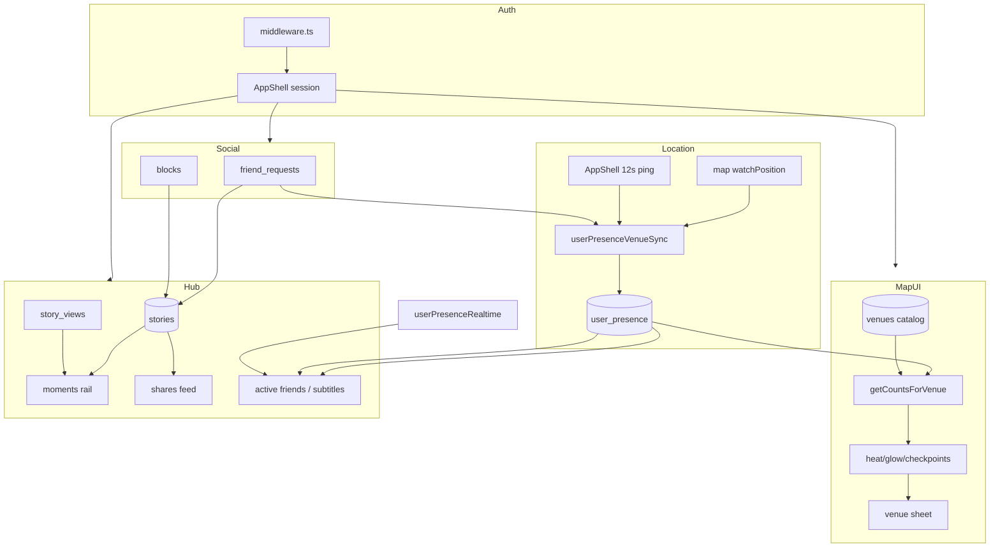

# PWA Behavioral Truth Audit — Intencity’s current DNA

**Purpose:** Full **system-truth + logic-truth** documentation of production **`apps/web`** before any native map/presence precision work. This is the canonical behavioral blueprint for native evolution — not a UI inventory.

**Status:** Code-mined **2026-05-18** from `apps/web`, `packages/shared`, and cross-checked against [SYSTEM_TRUTH_AUDIT.md](./SYSTEM_TRUTH_AUDIT.md).  
**Authority:** **PRIMARY** — production PWA behavioral truth ([DOCUMENTATION_GOVERNANCE.md](./DOCUMENTATION_GOVERNANCE.md)).  
**Doctrine:** Read [TRUTH_LAYER_DOCTRINE.md](./TRUTH_LAYER_DOCTRINE.md) and [PRESENCE_TRUST_ARCHITECTURE.md](./PRESENCE_TRUST_ARCHITECTURE.md) before interpreting this audit for native work.

**Rule:** If PWA logic is messy, document it **exactly**. Refinement happens **after** parity, not during reinterpretation. Native **execution** may evolve; **semantics** must not drift silently.

**Do not implement** until doctrine + this doc are reviewed: aggressive realtime, background tracking, predictive movement, heat/glow layers on native, or `user_presence` writes without [PRESENCE_OWNERSHIP.md](./PRESENCE_OWNERSHIP.md) sign-off.

**Related:** [TRUTH_LAYER_DOCTRINE.md](./TRUTH_LAYER_DOCTRINE.md) · [PRESENCE_TRUST_ARCHITECTURE.md](./PRESENCE_TRUST_ARCHITECTURE.md) · [NATIVE_PRESENCE_EVOLUTION.md](./NATIVE_PRESENCE_EVOLUTION.md) · [SYSTEM_TRUTH_AUDIT.md](./SYSTEM_TRUTH_AUDIT.md) · [TRUTH_DRIFT_REGISTER.md](./TRUTH_DRIFT_REGISTER.md) · [NATIVE_MAP_EVOLUTION.md](./NATIVE_MAP_EVOLUTION.md) · [MEDIA_BEHAVIOR_MATRIX.md](./MEDIA_BEHAVIOR_MATRIX.md) · [MIGRATION_PHASES.md](./MIGRATION_PHASES.md) · [PRESENCE_OWNERSHIP.md](./PRESENCE_OWNERSHIP.md)

---

## Core realization — what the PWA is and is not

### What the PWA fundamentally IS

The production machine is:

```
GPS coordinate snapshots
  → distance checks
  → venue zone FSM (inner_pending → inner_confirmed)
  → freshness windows (4m online / 20m live / 60m recent)
  → UI interpretation
```

The PWA answers: **“Where were you recently?”**

### What the PWA is NOT

The PWA does **not** have: motion engine, velocity prediction, adaptive presence polling, heading interpretation, accelerometer logic, native geofencing, background location ownership, motion classification, Kalman filtering, path reconstruction, or explicit confidence scoring. It mostly assumes **recent coord ≈ valid**.

Native may eventually own [five precision layers](./TRUTH_LAYER_DOCTRINE.md#core-realization-read-first); native must not pretend they exist early.

### What Intencity actually is (product semantics)

GPS is **fuel**. The product is **believable social geography**:

- inside / nearby / live / recent / online / ghost
- venue energy (`combined_count`), checkpoint ordering, visibility rules
- stories, shares, blocks, freshness windows

**Semantic parity** (same meanings) is mandatory before **execution evolution** (better GPS, GPU heat, smooth markers). See [PRESENCE_TRUST_ARCHITECTURE.md §4](./PRESENCE_TRUST_ARCHITECTURE.md).

### Recently somewhere vs continuously confident

| Question | PWA today | Native aspiration |
|----------|-----------|-------------------|
| Where were you **recently**? | Yes — snapshots + windows | Match first (P2O-C) |
| Where are you **continuously and confidently**? | No | Confidence architecture later (L2) |

UI must **never** imply continuous confidence until L2 supports it. Premature “alive city” visuals (heat, live markers, animated density) before confidence architecture = **trust collapse** ([PRESENCE_TRUST_ARCHITECTURE.md §7](./PRESENCE_TRUST_ARCHITECTURE.md)).

### Native phase names (trust-first)

| Old framing | Trust-first framing | Doc |
|-------------|---------------------|-----|
| Add GPS | Trustworthy location acquisition | P2O-B |
| Read live presence | Semantic validation parity | P2O-C |
| Alive map | Confidence visualization | MAP-B/C |
| Turn on writes | Presence authority migration | P2O-D |

Full sequencing: [NATIVE_PRESENCE_EVOLUTION.md](./NATIVE_PRESENCE_EVOLUTION.md).

---

## Classification legend

| Tag | Meaning | Native implication |
|-----|---------|-------------------|
| **CANON** | Sacred product truth — match until product changes shared constants or PWA | Port verbatim |
| **HEUR** | Tuned threshold/interval/visual — freeze during migration | Port values; tag any change |
| **WEB-WA** | Browser workaround that still defines **current** UX | Replicate behavior; adapter may differ |
| **TEMP** | Known compromise / partial / legacy column | Document; don’t “fix” silently on native |
| **PWA-LIAB** | Web performance or architecture debt | Native evolution target (execution only) |
| **NATIVE-TGT** | Should become more precise/realtime/smooth on native **without** semantic change | Phase after parity |
| **UNK** | Not verified or contradictory — resolve before port | Block or waive explicitly |

---

## Deliverable index

| # | Deliverable | Section |
|---|-------------|---------|
| 1 | Full behavioral truth audit | §1–§8 |
| 2 | System relationship map | §9 |
| 3 | Logic hierarchy | §10 |
| 4 | Exact thresholds/constants/windows | §11 |
| 5 | Canonical vs workaround per system | §12 |
| 6 | Complexity ranking | §13 |
| 7 | Native evolution opportunities | §14 |
| 8 | Recommended implementation ordering | §15 |

---

## §1 — Map + venue systems

**Primary source:** `apps/web/src/app/map/page.tsx` (~4k lines, monolith)  
**Supporting:** `districtFlowTrails.ts`, `venueCategoryAccent.ts`, `venueHeatColors.ts` → `@intencity/shared/heat`, `userPresenceVenueSync.ts`, `presence.ts`

### 1.1 Venue rendering & data load

| Behavior | Truth | Tag |
|----------|-------|-----|
| Venue catalog | `venues` query; `access_level === "public"` filter when user is public | **CANON** |
| Pins | Mapbox symbol layer `venues-anchor` — category glyph from `venueCategoryAccent` | **CANON** |
| Labels | `venues-name-labels`, `minzoom: 11.6` | **HEUR** |
| No venues loaded | Clear friend/presence HTML markers (avoid Philly pile-up) | **CANON** |
| Deep link | `?venueId=` → open sheet + `easeTo` zoom ≥ 15.8, 950ms (once per id) | **HEUR** |

### 1.2 Layer ordering (bottom → top)

```
map-brand-tone-overlay (full-map tint)
venues-activity-source (geojson)
  venue-heat          (heatmap)
  district-flow-glow  (line, before venue-glow)
  district-flow-core  (line)
  venue-glow          (circle, activity-stepped)
  venue-core          (circle, opacity ALWAYS 0 — dead layer)
  venues-anchor       (symbol pins)
  venues-name-labels
HTML mapboxgl.Marker  (friends + venue avatar stacks, above GL)
```

| Item | Tag |
|------|-----|
| Stack order + `combined_count` property semantics | **CANON** |
| `venue-core` always invisible | **TEMP** / **UNK** (glow carries energy) |
| `ambient_pulse` hardcoded 0 | **TEMP** |

### 1.3 Heat, glow, `combined_count`

**Activity count** — `getCountsForVenue(venueId, presence, friendsById, venues, meId)`:

| Rule | Tag |
|------|-----|
| Skip: `hiddenIds`, self, invalid coords, not `isPresenceLive` (20m) | **CANON** |
| Non-friends: only if `d ≤ outer_radius_m` | **CANON** |
| `redTotal` = inside `inner_radius_m` | **CANON** |
| `greenTotal` = inside outer but not inner | **CANON** |
| `combined_count` = red + green (GeoJSON + checkpoint `activity`) | **CANON** |
| Heat hex steps at 1 / 4 / 9 / 16 (`venueHeatHexFromActivity`) | **CANON** |
| Heatmap uses `heatmap-density` ramp (not raw count) | **HEUR** |
| Heatmap weight on `combined_count`: 0→0, 2→0.2, 6→0.5, 11→0.8, 18→1.2 | **HEUR** |
| Global heat “breathe” every 200ms on `heatmap-intensity` | **HEUR** |
| Checkpoint ring pulse: soft ≥9, strong ≥16 | **HEUR** |
| Arrival `checkpoint_pulse` 0→1 over 1600ms | **HEUR** |

**Venue sheet people** (`getVenuePeople`): uses `getPresenceFreshness !== "stale"` — includes **recent** (60m), **broader** than heat counts. | **CANON** split |

### 1.4 District flow (atmosphere)

| Constant | Value | Tag |
|----------|-------|-----|
| `DISTRICT_FLOW_FADE_MS` | 18_000 | **HEUR** |
| `DISTRICT_FLOW_MAX_EDGE_M` | 3200 | **HEUR** |
| `DISTRICT_FLOW_MAX_FEATURES` | 14 | **HEUR** |
| Strength decay | `*= 0.992` per 230ms tick | **HEUR** |
| Hidden when zoom ≥ 14.2 | | **HEUR** |

### 1.5 Checkpoints & auto-tour

| Behavior | Truth | Tag |
|----------|-------|-----|
| Sort | `activity` desc, then `distanceFromYou` asc | **CANON** |
| Distance fallback | you GPS → own presence → `selfPresenceCoordsRef` → MAX | **CANON** |
| Requires ≥2 checkpoints for auto-tour | | **CANON** |
| Auto-tour idle grace | 20_000 ms | **HEUR** |
| Auto-tour repeat | 4_000 ms | **HEUR** |
| Pause after interaction/locate/arrows | 2_200 ms | **HEUR** |
| Tick interval | 1_000 ms | **HEUR** |
| Setting | `localStorage.map_auto_venue_tour_enabled` default `"true"` | **HEUR** |
| Camera ease zoom | 16.2 + activity/24 − distance term, clamp [15.75, 17.05] | **HEUR** |

**Native today:** checkpoints in **catalog order** (category filter only) — **semantic drift** vs PWA.

### 1.6 Camera, locate, GPS

| Path | Mechanism | Tag |
|------|-----------|-----|
| Initial center | Philly fallback 39.9526, -75.1636 | **CANON** |
| First real GPS | one-time `easeTo` 800ms | **HEUR** |
| No GPS in 5s after map ready | force `hasInitialMapCenter` | **HEUR** |
| Map display | `watchPosition`, maxAge 5000 | **WEB-WA** |
| GPS denied | **keep last real fix** — no fake coords | **CANON** |
| AppShell ping | 12s `getCurrentPosition`, **skipped on `/map`** | **CANON** + **HEUR** |
| `runLocateCycle` priority | sheet venue → check-in venue → you → presence → fresh GPS | **CANON** |
| Two-tap locate | tap0 zoom max(15.5, cur); tap1 zoom 1.65 earth | **CANON** |
| Fallback coord filter | `isLikelyMapFallbackPresence` (~0.00045°) | **CANON** |

### 1.7 Venue sheet semantics

| Action | Behavior | Tag |
|--------|----------|-----|
| Open | layer click, cluster marker, `?venueId=`, friend with venue | **CANON** |
| Close | blank map click (heat **excluded** from hit test), drag >52px, wheel >20, X button, filter removes venue | **CANON** + **HEUR** |
| Hit layers open | anchor, core, glow, heat, labels | **WEB-WA** |
| Hit layers close | anchor, core, glow, labels (no heat) | **WEB-WA** |
| Event | `map-venue-sheet-visibility` | **CANON** |

### 1.8 Map refresh cadence

| Mechanism | Interval | Tag |
|-----------|----------|-----|
| `user_presence` load (visible tab) | **3 s** | **HEUR** |
| `presenceUiTick` re-render | **15 s** | **HEUR** |
| Presence **write** | on GPS coords change (not interval) | **CANON** |
| Map realtime channel | **none** (poll-only on map page) | **CANON** |
| Day/night style tick | 60 s (local hour 7–17 = day) | **HEUR** |
| Map load failsafe | 12 s | **HEUR** |

### 1.9 Clustering

Legacy Mapbox cluster layers **removed** on init. Friend/venue density uses **HTML markers** + avatar stacks, not GL clustering. | **CANON** (current architecture)

### 1.10 Category filters

Resolution: campus → food → events → nightlife → all (`venueCategoryAccent.ts`). Campus also matches `CAMPUS_VENUE_NAME_SUBSTRINGS`. Filter tray matchers in `page.tsx` parallel but not identical to accent file. | **CANON** list, **HEUR** matching

---

## §2 — Presence systems

**Sources:** `packages/shared/src/presence/*`, `packages/shared/src/venue/computePresenceFromGps.ts`, `apps/web/src/lib/userPresenceVenueSync.ts`, `userPresenceWrite.ts`, `userPresenceRealtime.ts`, `presence.ts`

### 2.1 Time windows (display vs heat)

| Function / use | Window | User-facing | Tag |
|----------------|--------|-------------|-----|
| `isFriendOnlineNow` | **4 min** | “Online”, “At {venue}”, pulse | **CANON** |
| `isPresenceLive` | **20 min** | Heat eligibility, “Away · At {venue}” | **CANON** |
| `isPresenceRecent` | **60 min** | “Recently active/at” | **CANON** |
| stale | beyond 60m | “Offline”, excluded from latest maps | **CANON** |
| `ghost_mode` | — | “Hiding location”; overrides all | **CANON** |

**Critical:** Online badge (4m) ≠ map live (20m) ≠ recent (60m). Never collapse on native.

### 2.2 Zone state machine (write path)

`computePresenceFromGps` (pure, shared):

1. Per venue: distance to lat/lng.
2. Best zone: **inner** (≤ `inner_radius_m`) > **outer** > **halo** (`haloLimitM`).
3. States: `outside` | `inner_pending` | `inner_confirmed`.
4. Enter inner → `inner_pending` + `enteredInnerAt`.
5. After **`INNER_CONFIRM_MS` = 60_000** → `inner_confirmed`.
6. Leave inner → `outside`.

Default radii if missing in shell: inner **35m**, outer **110m**. | **HEUR**

### 2.3 Write ownership & cadence

| Rule | Tag |
|------|-----|
| **One client writer per session** (web today) | **CANON** |
| Map path: `syncUserPresenceWithVenuesFromCoords` on `[you, venues, …]` | **CANON** |
| Shell path: same sync every **12s**, not on `/map` | **CANON** |
| Ghost write: `upsertUserPresenceGhostSafeCoords` — lat/lng kept; venue fields null; `outside` | **CANON** |
| Notifications on transitions | friend online (hour bucket), joined venue (day), nearby **300m** | **CANON** / **UNK** exact nearby path |

### 2.4 Read / sync / stale

| Surface | Read pattern | Tag |
|---------|--------------|-----|
| Map | 3s poll, no postgres sub | **HEUR** |
| Hub | postgres_changes + **45s** poll backup | **CANON** hybrid |
| Live places | postgres_changes + **25s** poll | **CANON** hybrid |
| Search explore | postgres_changes + **28s** poll | **CANON** hybrid |
| Friends page | postgres on `user_presence` for friend IDs | **CANON** |

Channels: `hub-user-presence`, `live-places-user-presence`, `search-user-presence:{meId}`, `friends-presence:{meId}`.

### 2.5 Visibility filtering (map)

| Rule | Tag |
|------|-----|
| Ghost friends hidden from others’ markers | **CANON** |
| `hiddenIds` excluded from counts | **CANON** |
| Non-friend presence in counts only within `outer_radius_m` | **CANON** |
| `getPresenceFreshness === "stale"` excluded from latest/active maps | **CANON** |
| Fallback Philly coords filtered | **CANON** |

### 2.6 Inside vs nearby vs live

| Context | “Inside” | “Nearby” | “Live” |
|---------|----------|----------|--------|
| Heat counts | ≤ inner_radius | ≤ outer, not inner | updated_at within 20m |
| Sheet people | zone + freshness ladder | copy from presence helpers | not stale |
| Social subtitle | `getFriendSocialActivitySubtitle` | uses windows above | 4m/20m/60m |

### 2.7 Block filtering

Blocks applied via `acceptedFriendIdsExcludingBlocks`, `idsBlockedWithMe`, `getPairBlockStatus` — excluded from friend lists, story fetches, chat send, moment visibility.

---

## §3 — Stories / shares / moments

**Sources:** `hub/page.tsx`, `StoryViewerModal.tsx`, `storyViews.ts`, `momentWindow.ts`, `storyRowShare.ts`, `ProfileStoriesGrid.tsx`, `moments/[id]/page.tsx`, `StoryCameraModal.tsx`

### 3.1 Data model

| Concept | Truth | Tag |
|---------|-------|-----|
| Unified table | `stories` rows | **CANON** |
| Moments | `is_share: false`, `expires_at` on create (~now+24h) | **CANON** |
| Shares | `is_share: true`, `expires_at: null` | **CANON** |
| Active moment window | `min(expires_at, created_at + 24h) > now` | **CANON** |
| `share_hidden` | hidden from hub + profile shares; in owner archive | **CANON** |
| `share_visible` | legacy `!== false` filter | **TEMP** |
| Media URLs | public bucket `getPublicUrl` — **no signed URLs** | **CANON** (web) |
| Views | `story_views` upsert; event `ah-story-viewed` | **CANON** |

### 3.2 Rings (three states)

| State | Condition | UI | Tag |
|-------|-----------|-----|-----|
| **none** | no active moment | plain avatar | **CANON** |
| **seen** | active; all in `story_views` | muted ring | **CANON** |
| **unseen** | active; ≥1 not viewed | glow ring | **CANON** |

| Rule | Tag |
|------|-----|
| Hub rail: only users with ≥1 active moment | **CANON** |
| Shares **never** in moments rail | **CANON** |
| Own `+` badge only when no active moment | **CANON** |
| `recordStoryView` in viewer skips shares | **CANON** |
| `/moments/[id]` records views for shares too | **HEUR** drift |
| Own profile on `/u/`: ring = live only, no unseen check | **HEUR** |
| Archive grid expiry without `min()` cap | **HEUR** drift vs `momentWindow` |

### 3.3 Viewer progression

| Behavior | Value | Tag |
|----------|-------|-----|
| Stories per group | newest-first (`created_at` desc) | **CANON** |
| Open index | caller `initialIndex`; hub opens index 0 | **CANON** |
| Auto-advance tick | 50ms, +1% progress | **HEUR** |
| Duration | ~5s per story (100 ticks) | **HEUR** |
| Tap zones | left 30% prev, right 30% next | **HEUR** |
| Swipe down close | >90px | **HEUR** |
| Preload | `stories[index+1].media_url` | **CANON** |
| Comments in modal | shares only | **CANON** |
| Owner menu in modal | delete only | **CANON** |

### 3.4 Hub feed

| Data | Query / limit | Tag |
|------|---------------|-----|
| Moments | friends+me, `is_share false`, limit 200, filter active | **CANON** |
| Shares | `is_share true`, `share_hidden false`, limit 120 | **CANON** |
| Friend ring order | first-seen order from global sort | **HEUR** |
| Share card previews | 4 comments ASC, like line max 3 names | **HEUR** |

### 3.5 Refresh triggers

| Event | Effect | Tag |
|-------|--------|-----|
| `story-posted` | broad reload (hub, profile, grids, live-places) | **CANON** |
| postgres_changes `stories` | hub debounce 120ms; profile own | **CANON** |
| `ah-story-viewed` | merge one id locally | **CANON** |
| `ah-share-likes-updated` / `ah-share-threads-updated` | patch hub card | **CANON** |
| Profile own stories poll | 120s | **HEUR** |
| `/u` moments poll | 15s | **HEUR** |
| Hub `presenceClock` | 15s (expiry re-filter) | **HEUR** |

### 3.6 Archive / hidden

| Surface | Content | Tag |
|---------|---------|-----|
| `/archive/hidden` | `share_hidden` shares | **CANON** |
| Profile archive tab | expired moments OR hidden shares (owner) | **CANON** |
| `/moments/[id]?view=archive` | owner-only reduced UI | **CANON** |

---

## §4 — Feed + refresh systems

### 4.1 Hub hydration gate

`feedReady` = `meId` && `venuesReady` && `storiesReady` && `sharesReady` && `avatarPaintReady`

| Stage | Behavior | Tag |
|-------|----------|-----|
| Not ready | `HubFeedSkeleton` | **CANON** |
| Ready | dispatch `ah-hub-feed-ready`, end auth overlay | **CANON** |
| Auth overlay cap | **10_000 ms** force ready | **HEUR** safety |
| `hubSwipersReady` | 560ms + double rAF after feedReady | **HEUR** |
| UI ready event | `ah-hub-ui-ready` | **CANON** |

### 4.2 Splash / loading hierarchy

`InitialAppSplash`: min **1000 ms** (550 reduced motion); hub wait max **8000 ms**; map **10000 ms**; session key `ah_splash_session_v1`.

### 4.3 Pull-to-refresh (AppShell)

| Constant | Value | Tag |
|----------|-------|-----|
| Enabled routes | hub, profile, notifications, chat, friends, `/u/*`, settings, search | **CANON** |
| Threshold | max(148, min(190, innerHeight * 0.21)) | **HEUR** |
| Reload | **320 ms** delay → `window.location.reload()` | **PWA-LIAB** |
| Cooldown | 1200ms | **HEUR** |

**Native:** prefer epoch invalidation, not full reload — **NATIVE-TGT**

### 4.4 Optimistic vs server

| Domain | Pattern | Tag |
|--------|---------|-----|
| Chat send | temp id; reconcile on realtime INSERT within 30s | **HEUR** |
| Story likes | server truth + event patches on hub | **CANON** |
| Presence subtitles | `presenceClock` tick without DB | **HEUR** |
| Scroll preservation | pathname change resets window scroll (AppShell) | **WEB-WA** |

### 4.5 Image loading

Public URLs; hub waits `avatarPaintReady` before feedReady. No app-level signed URL rotation.

---

## §5 — Social graph systems

**Sources:** `pairBlockStatus.ts`, `sendPendingFriendRequest.ts`, `blockUserAction.ts`, `friendsOfFriends.ts`, friends/blocks/u pages

| Behavior | Truth | Tag |
|----------|-------|-----|
| Accepted friends | FR `status=accepted`, minus blocks, `account_lifecycle_state=active` | **CANON** |
| Block | either orientation; `you_blocked` / `they_blocked` | **CANON** |
| Send FR | RPC `send_pending_friend_request` + insert fallback | **CANON** |
| FR notify | DB trigger on insert (not client on send) | **CANON** |
| Accept notify | client `createNotification` friend_request_accepted | **CANON** |
| Private profile posts | `viewerCanSeeOwnerPosts`: self, or !private, or accepted | **CANON** |
| FoF | mutual count, chunk 45, exclude friends/blocks/pending out | **CANON** |
| FoF sort | mutualCount desc, then name | **HEUR** |

### 5.1 School / public filtering

Signup: **Temple `@temple.edu` only** — **CANON** (client rule).  
Venues: `access_level` public filter on map when user public.

### 5.2 Ghost interactions

Ghost users: hidden from map markers; “Hiding location” copy; excluded from trending friend-weighted counts; friends list may still show with ghost subtitle rules.

---

## §6 — Auth + session systems

**Sources:** `middleware.ts`, `authGatePaths.ts`, `AppShell.tsx`, login/signup/onboarding pages, `ensureProfile.ts`

| Flow | Behavior | Tag |
|------|----------|-----|
| Protected routes | middleware → `/login?next=` | **CANON** |
| No profile row | sign out → `?account=removed` | **CANON** |
| Incomplete onboarding | force `/onboarding` | **CANON** |
| Complete + `/onboarding` | → `/hub` | **CANON** |
| Session | `getSession` + `getUser`; invalid → local signOut | **CANON** |
| `ensureProfileExists` | upsert `{ id }` on conflict | **CANON** |
| Legal consent | `POST /api/legal/consent` on login/signup | **CANON** web; native **UNK** U5 |
| Reset password | deep link `intencity://reset-password` | **CANON** |
| Username onboarding | separate `/onboarding/username` → `/profile` (not in middleware funnel) | **HEUR** |

### 6.1 RLS assumptions (high level)

- `friend_requests`: participant read; block guard on insert.
- `profiles` select: public OR self OR friends OR FoF-on-friends-list OR pending counterpart (no block).
- `get_profile_for_viewer(username)`: SECURITY DEFINER card + block_relation.
- `search_profiles_discovery`: DEFINER — can surface private accounts by handle.

---

## §7 — Chat / notifications / search

### 7.1 Chat (implemented, not placeholder)

| Item | Truth | Tag |
|------|-------|-----|
| Tables | `chats` + `messages` (not `conversations`) | **CANON** |
| DM create | find pair or insert `user1_id/user2_id` | **CANON** |
| Realtime | `chat:{id}` filtered; list subscribes all INSERTs | **CANON** + **PWA-LIAB** |
| Seen | receiver marks `messages.seen`; notifications read | **CANON** |
| Block | composer disabled client-side | **CANON** |
| Hide chat | `localStorage` `chat:hidden:{meId}` | **TEMP** |
| Dead code | `lib/chat.ts` getOrCreateDM | **TEMP** |

**Native:** read-only thread; send/realtime **deferred**.

### 7.2 Notifications

| Item | Truth | Tag |
|------|-------|-----|
| Activity page | excludes `type=message`, limit 200 | **CANON** |
| Grouping | ≥3 actors same story + like/comment → synthetic row | **HEUR** |
| Preferences | `notification_preferences` per type | **CANON** |
| Dedupe | `dedupe_key` unique skip 23505 | **CANON** |
| Push | `/api/push/notify` when enabled | **CANON** |
| Live toasts | message INSERT, 6s, max 3 stacked | **HEUR** |

### 7.3 Search / discovery

| Item | Truth | Tag |
|------|-------|-----|
| Debounce | 240ms | **HEUR** |
| People | RPC `search_profiles_discovery` limit 20 | **CANON** |
| Trending venues | presence inside inner/outer, friend-weighted, top 16 display / 24 compute | **CANON** |
| Recents | localStorage max 10 `ah_recent_discovery_searches_v1` | **HEUR** |
| Explore presence | realtime + 28s poll | **HEUR** |

**Placeholder status:** none for core search — fully wired on web.

---

## §8 — Global app state

### 8.1 Provider architecture

```
layout.tsx
  AuthRouteTransitionProvider
    AppShell
      ClientAuthProvider { sessionResolved, userId }
        children
        BottomNav (portal)
        modals: StoryCamera, CreateComposer, ShareComments, location notice
```

### 8.2 Modal orchestration

| Modal | Open trigger | Tab bar hidden when |
|-------|--------------|---------------------|
| Story camera | `open-story-camera` | `storyOpen` |
| Create composer | `open-create-composer` | `createOpen` |
| Share comments | `ah-open-share-comments` | sheet open |
| Story viewer | in-page state | `storyViewerOpen` |
| Map venue sheet | map page | `mapVenueSheetOpen` |

### 8.3 Refresh propagation

| Bus | Consumers |
|-----|-----------|
| `story-posted` | hub, profile, grids, live-places, u/[username] |
| `friends-updated` / `friend-removed` | search epoch, chat picker |
| `ah-hub-feed-ready` | splash, auth overlay |
| `map-venue-sheet-visibility` | AppShell tab bar |
| `ah-story-viewer-visibility` | AppShell chrome |

### 8.4 Epoch / clock patterns

| Pattern | Where | Purpose |
|---------|-------|---------|
| `presenceClock` | hub, profile, friends, u | Re-render subtitles without fetch |
| `socialGraphEpoch` | search | Reload FoF after graph change |
| `relationshipEpoch` | u/[username] | FR/block state |

No global React Query — **PWA-LIAB**; fetches per page + events.

---

## §9 — System relationship map



---

## §10 — Logic hierarchy (dependency order)

Understanding must follow this order — lower layers constrain upper layers:

```
L0  Auth session + profiles row (middleware, ensureProfile)
L1  Social graph (friends, blocks, hidden, ghost_mode, private)
L2  Location acquisition (GPS, no fake coords, map/shell split)
L3  Presence write FSM (computePresenceFromGps, INNER_CONFIRM_MS)
L4  user_presence row (updated_at drives all freshness)
L5  Freshness windows (4m / 20m / 60m) — NEVER collapsed
L6  Visibility filters (ghost, hidden, block, non-friend outer radius)
L7  Map aggregation (combined_count, heat steps, checkpoint sort)
L8  Map presentation (layers, markers, sheet, auto-tour)
L9  Stories/moments (momentWindow, story_views, rings)
L10 Feed composition (hub gates, ordering, share interactions)
L11 Secondary surfaces (chat, notifications, search trending)
L12 Global chrome (splash, pull-refresh, modals, tab bar)
```

**Native port rule:** Do not implement L7–L8 before L4–L6 are correct reads.

---

## §11 — Master constants registry

### 11.1 Shared presence (`packages/shared/src/presence/constants.ts`)

| Constant | Value | Tag |
|----------|-------|-----|
| `FRIEND_ONLINE_BADGE_MS` | 240_000 (4 min) | **CANON** |
| `MAP_ACTIVITY_WINDOW_MS` | 1_200_000 (20 min) | **CANON** |
| `RECENT_WINDOW_MS` | 3_600_000 (60 min) | **CANON** |
| `INNER_CONFIRM_MS` | 60_000 (60 s) | **CANON** |
| `NEARBY_THRESHOLD_M` | 300 | **CANON** / **UNK** notify path |
| `MAP_FALLBACK_CENTER` | 39.9526, -75.1636 | **CANON** |

### 11.2 Cross-surface poll matrix

| Surface | Interval | Realtime | Tag |
|---------|----------|----------|-----|
| Map presence load | 3s | no | **HEUR** |
| Map UI tick | 15s | — | **HEUR** |
| AppShell GPS | 12s (not /map) | — | **HEUR** |
| Hub presence | 45s | yes | **HEUR** |
| Hub presenceClock | 15s | — | **HEUR** |
| Live places | 25s | yes | **HEUR** |
| Search explore | 28s | yes | **HEUR** |
| Profile stories | 120s | yes (own) | **HEUR** |
| /u moments | 15s | — | **HEUR** |
| Friends presenceClock | 15s | yes FR+presence | **HEUR** |

### 11.3 Map page (`map/page.tsx`)

| Constant | Value |
|----------|-------|
| `AUTO_TOUR_IDLE_GRACE_MS` | 20_000 |
| `AUTO_TOUR_REPEAT_MS` | 4_000 |
| `AUTO_TOUR_PAUSE_MS` | 2_200 |
| `MAP_LOAD_FAILSAFE_MS` | 12_000 |
| `PRESENCE_MARKER_SMOOTH_ALPHA` | 0.18 |
| `CHECKPOINT_RING_PULSE_SOFT/STRONG` | 9 / 16 |
| Heat breathe tick | 200ms |
| District flow tick | 230ms |
| Initial zoom | 14 |
| Day hours | 7–17 local |

### 11.4 Hub / splash / viewer

| Constant | Value |
|----------|-------|
| `HUB_AUTH_OVERLAY_CAP_MS` | 10_000 |
| hubSwipers delay | 560ms + 2× rAF |
| Viewer progress tick | 50ms (~5s/story) |
| Hub moments limit | 200 |
| Hub shares limit | 120 |
| Share comment previews | 4 |
| Splash min | 1000ms |
| Splash hub max | 8000ms |

### 11.5 Chat / search / PTR

| Constant | Value |
|----------|-------|
| Chat long-press | 420ms |
| Chat optimistic reconcile | 30_000ms |
| Search debounce | 240ms |
| Search FoF chunk | 45 |
| PTR threshold | 148–190px |
| PTR reload delay | 320ms |
| Message toast | 6000ms, max 3 |

---

## §12 — Classification summary by system

| System | CANON | HEUR | WEB-WA | TEMP | PWA-LIAB | NATIVE-TGT |
|--------|-------|------|--------|------|----------|------------|
| Freshness windows | ● | | | | | |
| Zone FSM + ghost write | ● | radii defaults | | | | |
| getCountsForVenue | ● | heat paint | | dead venue-core | | GL heat |
| Checkpoint sort | ● | tour/camera | portal/idle | | | |
| GPS no-fake | ● | intervals | watchPosition | | | adaptive GPS |
| Hub moment rules | ● | ring order | | share_visible | | |
| story_views rings | ● | viewer timers | | view drift | | |
| feedReady gates | ● | caps/delays | | | | epoch refresh |
| Friends/blocks | ● | FoF sort | | chat hide local | | |
| Auth middleware | ● | username path | | | | |
| Chat/notifications | ● | grouping/toast | | dead chat.ts | list sub all msgs | filtered realtime |
| Pull-to-refresh | | threshold | | | full reload | invalidation |

---

## §13 — Complexity ranking

| Rank | System | Why | Native phase |
|------|--------|-----|--------------|
| **S** | Auth middleware + session | Foundational gate | Done |
| **S** | Moment window + story_views | Small pure rules | Mostly done |
| **A** | Stories hub feed + events | Many listeners, limits | Mostly done |
| **A** | Social graph + blocks | RLS + RPC + events | Mostly done |
| **B** | Freshness copy ladder | Shared pure fns | P2O-C |
| **B** | Chat thread + notifications | Realtime + prefs | Phase 3+ |
| **C** | Presence write FSM | Shared + DB + notify | P2O-D |
| **C** | Map getCountsForVenue | Rules + 3s poll | P2O-C |
| **D** | Map layers heat/glow/flow | Mapbox expressions + ticks | MAP-C |
| **D** | Map HTML markers + lerp | DOM perf | MAP-B |
| **D** | Auto-tour + checkpoint camera | Many timers | MAP-C |
| **E** | map/page.tsx monolith | Entangled | Split after parity |

---

## §14 — Native evolution opportunities

**Principle:** Improve **execution**, not **semantics** ([NATIVE_MAP_EVOLUTION.md](./NATIVE_MAP_EVOLUTION.md)).

| Area | PWA constraint | Native opportunity | Tag |
|------|----------------|-------------------|-----|
| Heat/glow rendering | DOM + 200ms breathe tick | GPU heatmap, batched layers | **NATIVE-TGT** |
| Marker motion | CSS lerp α=0.18 | Native GL + Reanimated | **NATIVE-TGT** |
| GPS battery | watchPosition + 3s poll | Foreground high accuracy; background throttled | **NATIVE-TGT** |
| Sheet physics | CSS drag/wheel | Reanimated + haptics | **NATIVE-TGT** |
| Feed refresh | `location.reload()` PTR | Query invalidation / epoch | **NATIVE-TGT** |
| Chat list RT | all messages channel | filtered postgres_changes | **NATIVE-TGT** |
| Presence read | 3s map poll | same windows + smarter merge | **NATIVE-TGT** |
| Offline | limited | venue catalog + tile cache | **NATIVE-TGT** |

**Do NOT add (until parity):** predictive movement, background tracking policy changes, new clustering semantics, AI routing, different freshness windows.

---

## §15 — Recommended implementation ordering

**Trust-first authority:** [NATIVE_PRESENCE_EVOLUTION.md](./NATIVE_PRESENCE_EVOLUTION.md) — this section is a summary.

Gated on [MIGRATION_PHASES.md](./MIGRATION_PHASES.md) VP-2 sign-off.

```
Doctrine lock — TRUTH_LAYER + PRESENCE_TRUST + governance (now)
    ↓
VP-2 honesty pass — no fake presence copy; ghost read-only
    ↓
P2O-B — Trustworthy location acquisition (NOT “add GPS”)
    ↓
P2O-C — Semantic validation parity (NOT “read live presence”)
    ↓
MAP-B — Confidence visualization: friend markers
    ↓
MAP-C — Confidence visualization: heat/glow/auto-tour (NOT “alive city”)
    ↓
P2O-D — Presence authority migration (NOT “turn on writes”)
    ↓
Phase 3+ — Chat send/realtime, notifications, search trending
    ↓
MAP-D — Intelligent geography (product + privacy gated)
```

**Parallel safe:** Media viewing polish, Core Feel Lock skeletons (no semantics).  
**Blocked until P2O-C:** heatmap, activity-sorted checkpoints, “live” counts in sheet.  
**Blocked until P2O-D:** ghost write, friend-nearby notifications from native GPS.

---

## §16 — Semantic drift register (PWA vs native today)

| # | Behavior | PWA | Native | Severity | Fix phase |
|---|----------|-----|--------|----------|-----------|
| 1 | Checkpoint order | activity → distance | catalog order | **High** | P2O-C |
| 2 | Locate | GPS two-tap cycle | bounds refit | **High** | P2O-B |
| 3 | Map friends copy | presence subtitles | “Nearby” placeholder | **High** | P2O-C |
| 4 | Ghost toggle | persists + ghost-safe write | read-only local | **High** | P2O-D |
| 5 | Heat/glow | full stack | none | **Med** (honest defer) | MAP-C |
| 6 | Hub active friends | live presence strip | static empty | **Med** | P2O-C |
| 7 | Trending search | presence-weighted | alphabetical / deferred | **Med** | P2O-C |
| 8 | Hub postgres stories RT | 120ms debounce | epoch only | **Low** | optional |
| 9 | PTR | full reload | N/A | **Low** | native invalidation |
| 10 | Legal consent API | POST on signup/login | deferred | **Med** | product |

---

## §17 — Open questions (UNK)

| ID | Question | Blocker |
|----|----------|---------|
| U1 | Exact `NEARBY_THRESHOLD_M` notification trigger vs sync path | P2O-D |
| U2 | Map page: any hidden realtime beyond 3s poll? | P2O-C |
| U3 | `presence_source` field for native beta cohort | P2O-D |
| U4 | Day/night map styles required on native? | VP-2 product |
| U5 | Legal consent API required App Store? | auth |
| U6 | `venue-core` layer intentional dead? | MAP-C |
| U7 | `upsertMyPresence` vs `userPresenceWrite` column drift | P2O-D |

---

## §18 — Sacred file index (behavioral sources)

| Domain | Path |
|--------|------|
| Map monolith | `apps/web/src/app/map/page.tsx` |
| Hub | `apps/web/src/app/hub/page.tsx` |
| Viewer | `apps/web/src/components/StoryViewerModal.tsx` |
| Presence sync | `apps/web/src/lib/userPresenceVenueSync.ts` |
| Presence constants | `packages/shared/src/presence/constants.ts` |
| Zone FSM | `packages/shared/src/venue/computePresenceFromGps.ts` |
| Freshness | `packages/shared/src/presence/freshness.ts` |
| Stories views | `apps/web/src/lib/storyViews.ts` |
| Moment expiry | `apps/web/src/lib/momentWindow.ts` |
| Shell / PTR / GPS | `apps/web/src/components/AppShell.tsx` |
| Auth gate | `apps/web/middleware.ts` |
| Chat | `apps/web/src/app/chat/page.tsx`, `chat/[id]/page.tsx` |
| Search | `apps/web/src/app/search/page.tsx` |
| Realtime sub | `apps/web/src/lib/userPresenceRealtime.ts` |

---

## Maintenance

- Update this file when **PWA behavior** changes.
- Update [SYSTEM_TRUTH_AUDIT.md](./SYSTEM_TRUTH_AUDIT.md) for presence/map-only deep edits (or merge chapters here over time).
- Native PRs that change user-visible rules must cite § and tag.

---

---

## §19 — Documentation cross-links (governance)

| Document | Role |
|----------|------|
| [TRUTH_LAYER_DOCTRINE.md](./TRUTH_LAYER_DOCTRINE.md) | L0–L5 + decision filter |
| [PRESENCE_TRUST_ARCHITECTURE.md](./PRESENCE_TRUST_ARCHITECTURE.md) | Confidence, honesty, philosophy |
| [NATIVE_PRESENCE_EVOLUTION.md](./NATIVE_PRESENCE_EVOLUTION.md) | Trust-first native phases |
| [DOCUMENTATION_GOVERNANCE.md](./DOCUMENTATION_GOVERNANCE.md) | Doc authority tiers |
| [TRUTH_DRIFT_REGISTER.md](./TRUTH_DRIFT_REGISTER.md) | Doc/code mismatches |
| [WORKSPACE_EVOLUTION_PLAN.md](./WORKSPACE_EVOLUTION_PLAN.md) | Proposed `/docs` layout (no moves yet) |

---

*End of PWA Behavioral Truth Audit — 2026-05-18 (doctrine lock revision)*

