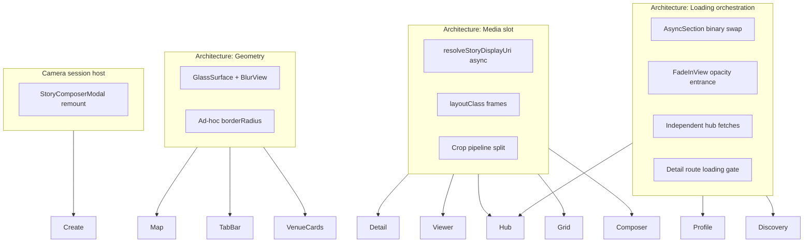

# VP-2X — Execution stability & interaction cohesion audit

**Date:** 2026-05-18  
**Phase:** VP-2X (new subphase) — **audit + planning only; no implementation**  
**Blocks:** P2O-B, GPS, presence, heat/glow, realtime, map spectacle  
**Authority:** Device QA screenshots + `apps/mobile` code review  
**Related:** [VP2_COMPLETION_AUDIT.md](./VP2_COMPLETION_AUDIT.md) · [INTENCITY_MEDIA_DOCTRINE.md](./INTENCITY_MEDIA_DOCTRINE.md) · [MEDIA_ARCHITECTURE_AUDIT.md](./MEDIA_ARCHITECTURE_AUDIT.md) · [IMPLEMENTATION_DECISION_FRAMEWORK.md](./IMPLEMENTATION_DECISION_FRAMEWORK.md)

---

## Executive summary

The app’s weakness is **not missing features** — it is **uncoordinated async rendering**. Multiple independent subsystems (hub sections, profile header, tab grids, signed URL resolution, camera lifecycle) each mount, load, and reveal on their own schedule. The user experiences **sequential layout reflow**, **opacity fades stacked on skeleton swaps**, and **different media geometry per depth** — which reads as “prototype,” not “premium product.”

**Root cause in one sentence:**

> There is no **screen-level orchestration layer** that reserves stable shells and reveals content on a single intentional timeline.

VP-2 media tokens helped; VP-2X must fix **lifecycle orchestration**, **geometry system**, and **depth continuity**.

---

## 1. Root-cause analysis

### 1.1 The “reactive render” anti-pattern

| Pattern | Where | Effect |
|---------|-------|--------|
| **Binary skeleton ↔ content swap** | `AsyncSection` | Skeleton unmounts → zero height or different height → content mounts → scroll jumps |
| **Opacity fade on every section reveal** | `FadeInView` via `AsyncSection` | Section appears at opacity 0 then fades; combined with swap feels like double-blink |
| **Independent section loading** | `hub.tsx` (moments, places, shares each own `AsyncSection`) | Page “shakes” as blocks arrive at different times |
| **Header block swap** | `profile.tsx` `loading ? ProfileHeaderSkeleton : ProfileIdentityBlock` | Large vertical shift when profile row hydrates |
| **Tab panel height not reserved** | `ProfileTabGrid` | Switching Shares ↔ Archive changes content height abruptly |
| **Async image URI resolve** | `IntencityRemoteImage` | Placeholder → signed URL → fade-in; OK if frame fixed, jarring if not |
| **Full-screen loading gate** | `MomentDetailScreen` `if (loading) return …` | Entire route unmounts layout; re-mount on hydrate = first-open instability |

**Classification:** **Architecture-level** — needs a shared `ScreenReady` / `StableSlot` primitive, not per-screen tweaks.

### 1.2 Media is one object, many depth languages

Same `stories` row, different **container contracts**:

| Depth | Container | Aspect philosophy | User mental model |
|-------|-----------|-------------------|-------------------|
| Composer preview | `shareFeedPreviewFrameStyle` / `verticalStoryPreviewFrameStyle` | WYSIWYG target | “What I’m posting” |
| Hub feed | `SHARE_FEED_DISPLAY` (width × `min(52vw,280)`) | Immersion cap | “Feed card” |
| Moment detail | `SHARE_DETAIL` (4:5, rounded `cardRadius`) | Detail frame | “Post page” |
| Story viewer | `FULLSCREEN_IMMERSIVE` | Full bleed cover | “Story” |
| Profile / archive grid | `SQUARE_GRID` 1:1 | Thumbnail | “Grid cell” |

**Device QA confirms:** composer preview can still **letterbox** (landscape in hub-height box on black stage) while hub **cover-crops** the same asset — user does not believe it is the same object.

**Crop pipeline:** Library uses OS crop; camera uses `centerCropRect` (`storyImageCrop.ts`) — **not** PWA interactive crop. Trustworthy for aspect ratio, not for user framing intent.

**Classification:** **Architecture-level** media depth contract + **local** preview stage layout.

### 1.3 Geometry / clipping hierarchy is inconsistent

| Issue | Example | Mechanism |
|-------|---------|-----------|
| **Child radius > parent** | `MapCheckpointBar` nav buttons `borderRadius: 22` inside bar `borderRadius: 18` | Parent `overflow` not clipping circles → corners look octagonal / clipped |
| **Blur outside clip** | `GlassSurface` + `BlurView` on venue cards, tab bar, map pills | Shadow/glow + blur sampling beyond rounded rect (map checkpoint purple bleed in QA) |
| **Nested glass radii** | Tab bar `barRadius: 18.4` vs wells `iconWellRadius: 10` vs create `createRadius: 10` | No `radius - padding` inheritance rule |
| **Media radius mismatch** | Hub feed `feedMediaRadius: 2` vs detail `layout.cardRadius: 18` | Same share feels like different product layers |
| **Archive stamp overlay** | `archiveStamp` gradient on square cell | May ignore cell `overflow: hidden` if not applied on wrap |

**Classification:** **Architecture-level** `radiusTokens` + **local** map checkpoint / archive cell fixes.

### 1.4 Camera lifecycle = remount + state storm

`StoryComposerModal.tsx`:

- `visible` → `resetSession()` + `initCamera()` every open (**full session reset**)
- `CameraView` unmounts between `starting` / `live` / `preview` / `unavailable`
- `onCameraReady` → `setCameraReady` → rerender while live
- Mode switch clears preview → `setSurface("live")` → camera remount
- `Modal` `animationType="slide"` adds motion on top of camera startup

**User feel:** jittery, delayed snap-in, unstable preview.

**Classification:** **Architecture-level** camera session host (keep camera mounted, overlay states).

### 1.5 Feed ↔ viewer continuity is broken for shares

| Path | Destination |
|------|-------------|
| Hub share tap | `/moments/[id]` detail (4:5 rounded scroll) |
| Profile share tap | Same detail |
| Moment rail tap | `StoryViewerModal` fullscreen |

Shares never open in a **feed-continuous** viewer; detail uses **different aspect + radius** than hub card. User cannot subconsciously map “this card opened this surface.”

**Classification:** **Product-semantic path is correct (PWA)** but **execution continuity** needs shared crop anchor + transition language (not necessarily same route).

### 1.6 Archive: functional but visually “incomplete”

Code paths exist (`ProfileTabGrid` archive → `/moments/[id]?view=archive`, hidden → `/archive-hidden`). QA issues:

- Large empty void below grid (no min-height / no scroll fill)
- Timestamp overlay on thumbnails (readable but “prototype grid”)
- No shared archive skeleton matching grid + stamp
- Tap goes to **detail** not viewer — different from moments rail behavior

**Classification:** **Mixed** — routing OK; **orchestration + visual system** incomplete.

---

## 2. Priority-ranked instability list

### P0 — User feels “what is happening?”

| ID | Instability | Surfaces | Type |
|----|-------------|----------|------|
| **XS-001** | Hub multi-section staggered load (moments → places → shares) | Hub | Architecture |
| **XS-002** | `AsyncSection` skeleton unmount before content (layout collapse) | Hub, discovery, live places | Architecture |
| **XS-003** | Signed URL resolve + fade without unified “slot ready” gate | All `StoryMediaImage` | Architecture |
| **XS-004** | Composer preview ≠ hub crop (letterbox vs cover) | Composer → Hub | Media contract |
| **XS-005** | Camera session reset/remount on every open | Create | Camera lifecycle |
| **XS-006** | Profile header skeleton ↔ identity swap | Profile | Orchestration |
| **XS-007** | Moment detail full-route loading remount | `/moments/[id]` | Orchestration |

### P1 — Breaks premium / continuity

| ID | Instability | Surfaces | Type |
|----|-------------|----------|------|
| **XS-101** | Hub share → detail aspect jump (height-cap → 4:5 rounded) | Hub → Detail | Depth continuity |
| **XS-102** | Map checkpoint glow bleeds / octagonal nav clips | Map | Geometry |
| **XS-103** | Glass blur bleed on cards (venues, tab bar) | Hub, Map, Tab bar | Geometry |
| **XS-104** | Profile tab switch height jump | Profile | Orchestration |
| **XS-105** | Archive grid empty void + overlay stamps | Profile Archive | Local + layout |
| **XS-106** | Misleading hub copy: `feedTail` when shares exist | Hub | Local |
| **XS-107** | Venue cards: initials placeholder → image pop | Hub Live Places | Loading |
| **XS-108** | `FadeInView` re-fade on every `contentKey` change | Global | Architecture |

### P2 — Polish / performance

| ID | Instability | Surfaces | Type |
|----|-------------|----------|------|
| **XS-201** | Hub parent rerenders (moments + shares stats) | Hub | Performance |
| **XS-202** | Story viewer chrome rerenders on progress tick | Viewer | Performance (partially mitigated: `StoryViewerMediaLayer`) |
| **XS-203** | Hub shares `ScrollView` not virtualized | Hub | Performance |
| **XS-204** | Center crop ≠ interactive crop (framing trust) | Camera | Media (MD-106) |

---

## 3. Surfaces sharing the same underlying instability



| Shared root | Affected surfaces |
|-----------|-------------------|
| **XS-001 / XS-002 / XS-008** | Hub, Live Places, Discovery, any `AsyncSection` user |
| **XS-003** | Hub shares, profile grid, archive, detail, viewer, comments avatars |
| **XS-004 / XS-101** | Composer, hub, detail (shares); composer, viewer (moments) |
| **XS-005** | Create tab, hub CTA, profile “new share” |
| **XS-102 / XS-103** | Map checkpoint, map pills, tab bar, venue chips, glass controls |
| **XS-006 / XS-104 / XS-105** | Profile (all tabs) |

---

## 4. Architecture-level vs local-component fixes

| Fix type | What | Examples |
|----------|------|----------|
| **Architecture** | New primitives used everywhere | `StableSlot`, `ScreenSectionOrchestrator`, `MediaSlot`, `RadiusScale`, `CameraSessionHost` |
| **System config** | Single token file consumed by all | `mediaLayout` (exists), extend with `radiusScale`, `hubScreenLayout` |
| **Local** | One-off bug | Remove `feedTail` when shares > 0; checkpoint nav size; archive link styling |

**Rule for VP-2X implementation:** No third hub spacing tweak without going through orchestration primitive.

---

## 5. Proposed systemic fixes (planning only)

### 5.1 Loading orchestration (highest ROI)

**Replace** binary `AsyncSection` with **`StableSlot`**:

```txt
1. Reserve min-height (or exact height from layout tokens) immediately
2. Show skeleton INSIDE slot (never unmount slot)
3. Fetch data
4. When image URI resolved AND copy ready → crossfade content inside slot
5. Optional: screen-level "phase ready" to reveal whole hub band together
```

**Hub-specific:** `useHubScreenReady()` — wait for `{ momentsRail, places, shares }` or staged bands:

- Band A: chrome + search (instant)
- Band B: moments rail (fixed height)
- Band C: places rail (fixed card height)
- Band D: shares (fixed card skeleton height = `hubShareMediaHeight`)

**Detail-specific:** Inline skeleton **in same tree** as loaded content (no early `return`).

### 5.2 Media contract unification

**Introduce `MediaSlot` component:**

| Prop | Purpose |
|------|---------|
| `layoutClass` | From `mediaLayout` |
| `uri` | Stored URL |
| `cropAnchor` | Optional: top/center (continuity) |
| `ready` | Parent gates fade until resolve |

**Depth continuity matrix (shares):**

| Stage | Must match |
|-------|------------|
| Composer preview | Hub `SHARE_FEED_DISPLAY` frame exactly |
| Hub card | Same |
| Detail | Accept 4:5 PWA rule but use **same horizontal crop center** |
| Viewer (if ever) | N/A for shares today |

**Crop trust:** Keep center crop; add **optional** re-crop UI later (MEDIA-1.1). Until then, preview frame must **simulate hub crop** with `cover` in identical box.

### 5.3 Geometry system

**`radiusScale` token:**

| Token | px | Use |
|-------|-----|-----|
| `pill` | 999 | Buttons |
| `sheet` | 18 | Cards, tab bar |
| `control` | 10 | Icon wells inside sheet |
| `mediaFeed` | 2 | Hub share media |
| `mediaDetail` | 18 | Detail (PWA) |

**Rule:** child radius ≤ parent radius − borderWidth.

**Blur:** Apply `GlassSurface` only to **chrome**, not full-bleed photo cards; photos in plain `View` with `overflow: hidden`.

### 5.4 Camera stabilization

**`CameraSessionHost`:**

- Mount camera once per modal session
- Overlay UI as absolute layers (no unmount `CameraView` on preview)
- `starting` = opacity overlay, not unmount
- Debounce readiness; avoid permission → live → starting flicker
- Preview: reuse same surface dimensions as post path

### 5.5 Feed / viewer continuity

**Minimum (VP-2X):**

- Shared `MediaSlot` + identical hub/preview frames
- Hero transition: optional shared `layoutId` / matched geometry push (expo-router shared element if feasible) OR same top crop offset

**Not in scope:** Changing share tap target from detail to viewer (semantic).

### 5.6 Archive completion

- Grid: `StableSlot` 3×3 with fixed cell aspect
- Skeleton includes stamp bar space
- Tap: keep detail route; ensure `archiveView` hides comments/actions consistently
- Hidden shares: same grid component
- Remove excess bottom void (`minHeight` on panel or fill scroll)

---

## 6. Recommended implementation order

| Order | Workstream | Closes | Risk |
|-------|------------|--------|------|
| **1** | `StableSlot` + replace `AsyncSection` on Hub | XS-001, 002, 108 | Medium — touch hub only first |
| **2** | `MediaSlot` + composer preview = hub frame | XS-004, 003 (partial) | Medium |
| **3** | Profile header inline skeleton (no swap) | XS-006 | Low |
| **4** | Moment detail inline hydrate | XS-007 | Low |
| **5** | `radiusScale` + map checkpoint + glass-on-photo audit | XS-102, 103 | Low |
| **6** | `CameraSessionHost` refactor | XS-005 | High — test devices |
| **7** | Profile tab `StableSlot` grids | XS-104, 105 | Medium |
| **8** | Hub tail copy + archive polish | XS-106, 105 | Low |
| **9** | Performance pass (FlatList, viewer chrome split) | XS-201–203 | Medium |

**Do not start P2O-B until:** XS-001, 002, 004, 005, 006 show clear device QA improvement.

---

## 7. PWA audit notes (execution-only)

| PWA behavior | Native VP-2X stance |
|--------------|---------------------|
| Hub share `max-h-[min(52vw,280px)]` | Keep — fix preview to match |
| Share detail 4:5 | Keep — align crop center with feed |
| Story viewer fullscreen | Keep — moments only |
| Archive grid + timestamps | Keep semantics — improve shell |
| Map checkpoint white bar | Keep — fix glow clip |
| `react-easy-crop` | Defer interactive crop; fix preview honesty first |

---

## 8. What NOT to do in VP-2X

- GPS / `expo-location`
- Heat, glow semantics, live markers
- Presence writes / reads
- Realtime channels
- New navigation IA
- Random per-component spacing tweaks
- Instagram-style feed redesign

---

## 9. Success criteria (device QA)

User should **not** notice:

- Sections popping in one-by-one on hub first open
- Cards changing height after images load
- Composer preview looking different from posted feed
- Camera “jumping” when opening or flipping
- Octagonal corners on map checkpoint / glass pills
- Profile header jumping from skeleton to content

User **should** feel:

- Calm hub load (stable bands)
- Same photo crop from preview → feed → detail
- Camera ready without layout snap
- Archive grid intentional, tappable, continuous

---

## 10. Deliverables checklist

| Deliverable | Status |
|-------------|--------|
| Root-cause analysis | ✅ §1 |
| Priority-ranked instability list | ✅ §2 |
| Proposed systemic fixes | ✅ §5 |
| Architecture vs local | ✅ §4 |
| Shared underlying instabilities | ✅ §3 |
| Implementation order | ✅ §6 |

**Next step when approved:** Implement workstream **1–2** as first VP-2X PR (hub orchestration + media slot), device QA, then continue order.

---

## Changelog

| Date | Change |
|------|--------|
| 2026-05-18 | Initial VP-2X audit from device QA + code review |
